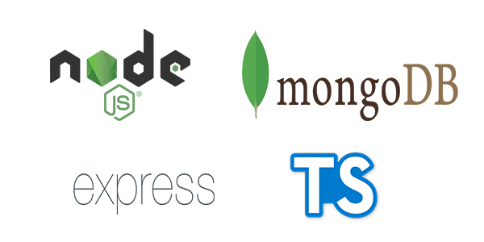

<h1 align="center">tsnode-mongo</h1>

<div align="center">
  
</div>

<p>
  
  <a href="#" target="_blank">
    
  </a>
  <a href="https://twitter.com/VictorSoares\_96" target="_blank">
    
  </a>
</p>

## Uma aplicação Express com Typescript, Sucrase e Mongoose

## Install

```sh
yarn install
```

## Usage

```sh
yarn dev
```

### Application listen on: http://localhost:3333

## Author

👤 **Victor Soares**

* Website: victorsoares96.netlify.app
* Twitter: [@VictorSoares\_96](https://twitter.com/VictorSoares\_96)
* Github: [@victorsoares96](https://github.com/victorsoares96)
* LinkedIn: [@victor-soares96](https://linkedin.com/in/victor-soares96)

## Show your support

Give a ⭐️ if this project helped you!

***
_This README was generated with ❤️ by [readme-md-generator](https://github.com/kefranabg/readme-md-generator)_